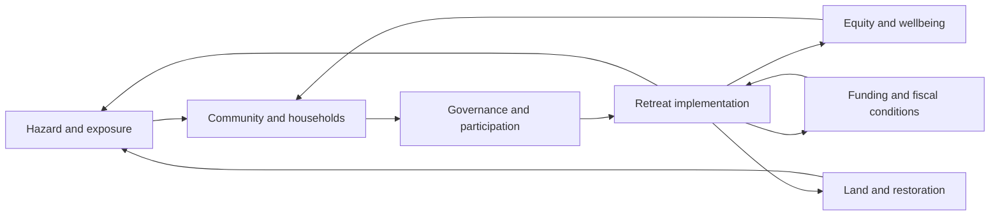

# Project overview

**Harris County Managed Retreat System Dynamics** is the descriptive name for the project previously organized as the Prashant Vensim project and published as Managed Retreat Scenario Model. It develops the architecture in the shared managed-retreat guide and October 15, 2024 mind map. The literature matrix is outside its boundary.

## Research questions

1. How do funding, administrative throughput, household participation, and hazard pressure interact to influence the pace of retreat?
2. How do policy timing and compensation choices affect remaining flood exposure, household relocation, and local fiscal conditions?
3. Under which assumptions can retreat reduce unequal burdens while supporting community wellbeing and ecological restoration?

These are prospective scenario questions. The current release does not estimate causal policy effects or rank policy options.

## Seven connected subsystems

| Subsystem | Main accounting or behavioral contribution | Example outcomes |
| --- | --- | --- |
| Hazard | Exposure, event pressure, damage, and climate forcing | Properties at risk, disaster costs |
| Community | Population, tenure, relocation, and social relationships | Population change, household movement, social capital |
| Fiscal | Funding availability, program spending, and tax-base change | Remaining funds, costs, fiscal stress |
| Governance | Policy development, engagement, and trust | Participation conditions, policy progress |
| Implementation | Application pipeline, capacity, acquisition, and relocation support | Completed retreat, waiting time, support delivery |
| Equity | Distribution of assistance and household outcomes | Adequacy of support, wellbeing, psychosocial stress |
| Land | Acquired land, restoration, and ecological condition | Restored hectares, ecosystem condition |

This diagram summarizes intended connections. It is not a validated causal loop or a compiled stock-flow model; see the dependency register and proposed equation repairs for specific relationships.

## Spatial and temporal boundary

The primary case is Harris County, Texas (FIPS 48201). Social evidence is organized on 2020 census tracts where available. The reference year is 2024, the historical evidence window is 2010–2024, and proposed scenarios span 2025–2050. The proposed time step is 0.25 years; integration method and numerical stability remain to be tested in Vensim.

Scenario currency is constant 2024 US dollars. Historical financial observations retain nominal source-year amounts. A documented deflator is needed before combining them in real-dollar cost calibration. Baseline funding balances and legacy obligations must be aligned when comparing ongoing programs with a hypothetical new program.

Parcel exposure uses 2024 HCAD records with March 2026 flood-map geometry. That mixed-vintage screening proxy is neither an as-known-in-2024 exposure estimate nor a measure of all flood risk. County fiscal values must not be interpreted as a municipality's tax base.

## Design authority

The earlier [model design](MODEL_DESIGN.md) preserves the guide architecture. The September 15 [data dictionary](../documentation/Model_Data_Dictionary.csv) records guide expressions separately from proposed measurement definitions and equation repairs. Older templates are examples; they do not override the current Harris County evidence records. Final authority for executable equations will require explicit reconciliation with the actual Vensim model.
